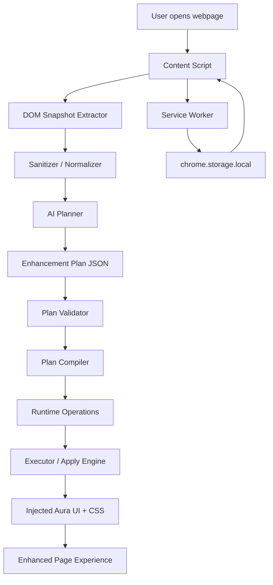
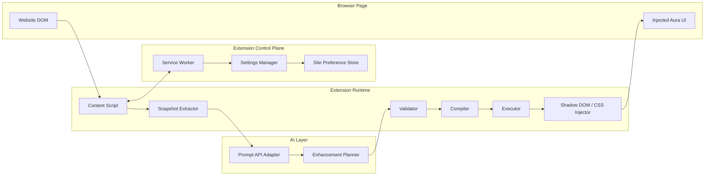
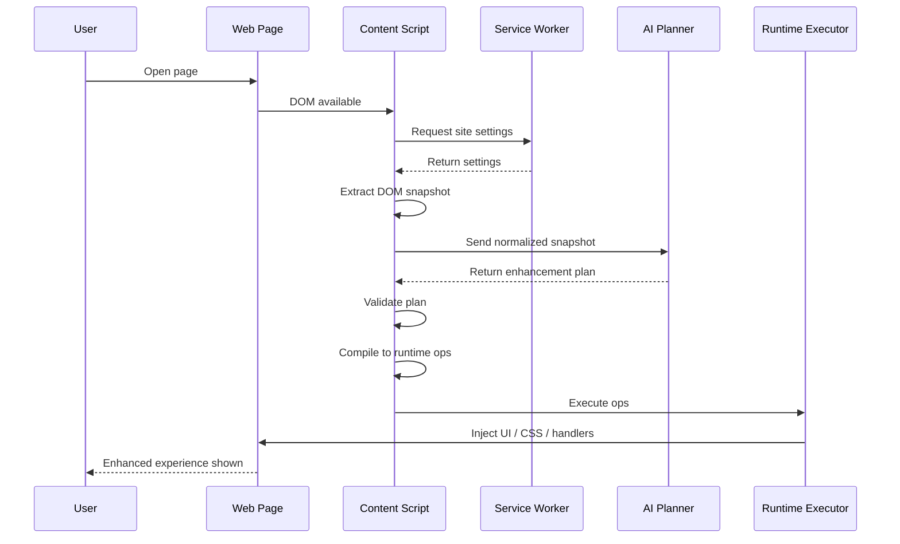
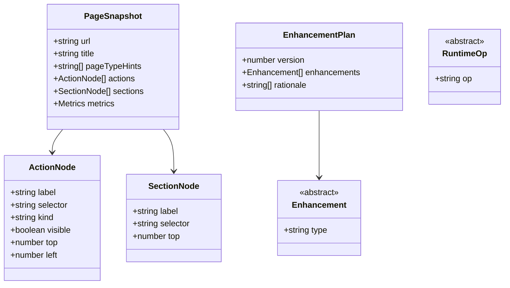
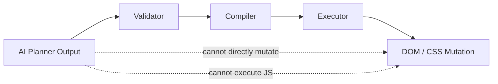
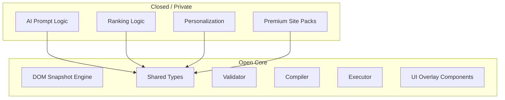
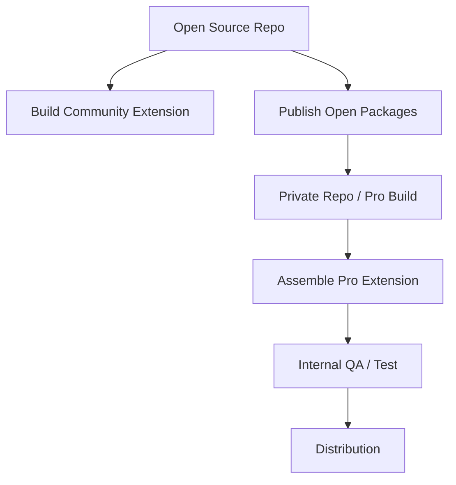
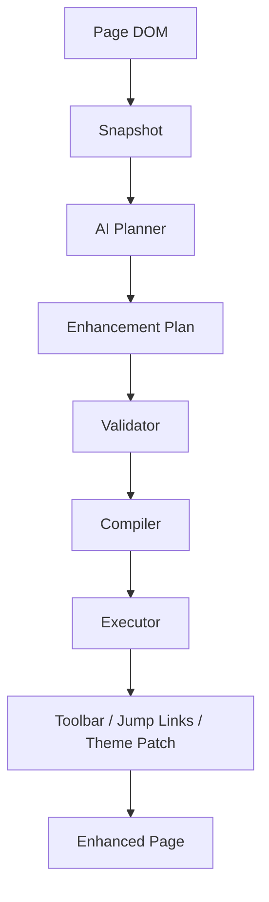

# PageAura Detailed Architecture Diagram

## 1. Purpose

This document describes the detailed runtime and build architecture for the **PageAura MVP**.

PageAura is a Chrome Extension that:
- reads the current page DOM,
- creates a structured snapshot,
- sends that snapshot to an AI planner,
- receives a structured enhancement plan,
- validates the plan,
- compiles it into trusted runtime operations,
- and applies reversible UI enhancements to the page.

The system is designed so that:
- **AI is mandatory for planning**
- **AI does not execute arbitrary code**
- **all page mutations are performed by packaged extension code**
- **enhancements are safe, bounded, and reversible**

---

## 2. High-Level System Diagram



---

## 3. Component Diagram



---

## 4. Runtime Pipeline



---

## 5. Core Runtime Layers

## 5.1 Content Script Layer

### Responsibilities
- detect page load and SPA route changes
- access page DOM
- build page snapshot
- call AI planner
- validate plan
- compile plan
- execute approved enhancements

### Why it exists
The content script is the only runtime component that has direct access to the live DOM.

### Inputs
- webpage DOM
- site settings from service worker
- stored preferences

### Outputs
- structured `PageSnapshot`
- validated `EnhancementPlan`
- applied UI enhancements

---

## 5.2 Service Worker Layer

### Responsibilities
- orchestrate extension-level messaging
- manage settings and feature flags
- read and write `chrome.storage.local`
- expose enable/disable state per site
- store dismissed/accepted enhancement memory

### Why it exists
The service worker is the extension control plane for state and coordination.

### Inputs
- messages from content script
- popup/options updates
- site preference changes

### Outputs
- settings payloads
- local persistence
- capability flags

---

## 5.3 AI Planning Layer

### Responsibilities
- receive normalized page snapshot
- infer page type
- choose safe enhancement types
- return a bounded JSON enhancement plan

### Design Rule
AI may decide:
- what to improve
- what targets matter
- what intensity/tokens to use

AI may not:
- return arbitrary JavaScript to execute
- bypass validation
- mutate DOM directly

### Output Contract
The planner returns a JSON plan such as:

```json
{
  "version": 1,
  "enhancements": [
    {
      "type": "insert_toolbar",
      "actions": [
        { "label": "Search", "selector": "input[type='text']" }
      ]
    },
    {
      "type": "jump_links",
      "sections": [
        { "label": "Jobs", "selector": "#jjj" }
      ]
    },
    {
      "type": "theme_patch",
      "tokens": {
        "textScale": 1.04,
        "radius": 10
      }
    }
  ]
}
```

---

## 5.4 Validation Layer

### Responsibilities
- schema validation
- selector existence checks
- bounds checking
- capability checking
- safety checks

### Example checks
- enhancement type must be known
- selector must resolve to an element
- text scale must be within allowed range
- maximum number of actions must not exceed limit
- destructive elements should not be promoted automatically

### Result
Only a **Safe Plan** is allowed to continue.

---

## 5.5 Compiler Layer

### Responsibilities
Convert a high-level enhancement plan into low-level runtime operations.

### Example
Input plan:
```json
{
  "type": "insert_toolbar",
  "actions": [
    { "label": "Search", "selector": "input[type='text']" }
  ]
}
```

Compiled ops:
```json
[
  { "op": "mount_container", "id": "toolbar", "area": "top-right" },
  { "op": "add_button", "containerId": "toolbar", "label": "Search", "selector": "input[type='text']" }
]
```

### Why this layer matters
It separates:
- **AI semantics**
from
- **trusted runtime behavior**

---

## 5.6 Executor Layer

### Responsibilities
Interpret runtime ops and apply them to the page safely.

### Supported actions
- mount overlay containers
- inject scoped CSS
- add quick action buttons
- add jump navigation
- apply style classes
- bind safe event handlers

### Important constraint
The executor only runs packaged logic already shipped inside the extension.

---

## 6. Data Model Diagram



---

## 7. Enhancement Families

The MVP should support a small, stable set of enhancement families.

## 7.1 insert_toolbar
Adds a floating or sticky quick action bar.

### Typical uses
- focus search
- jump to key actions
- highlight commonly used controls

## 7.2 jump_links
Adds section shortcuts for dense pages.

### Typical uses
- scroll to jobs
- scroll to for-sale
- scroll to housing

## 7.3 theme_patch
Applies page-level visual tokens.

### Typical uses
- slightly increase text scale
- improve spacing
- soften borders
- modernize radius

## 7.4 style_patch
Applies styling to semantic target groups.

### Typical uses
- emphasize primary buttons
- improve body text readability
- soften tables and cards

---

## 8. Trust Boundary Diagram



### Key principle
The AI is outside the trusted execution boundary.

The trusted boundary begins at:
- validator
- compiler
- executor

---

## 9. Open vs Closed Architecture



### Dependency Rule
- Private modules may depend on open packages
- Open packages must never depend on private modules

---

## 10. Build and Deployment Architecture



### Community Build
Contains:
- snapshot engine
- validator
- compiler
- executor
- UI overlay
- basic planner or mock planner

### Pro Build
Contains:
- open core
- private AI planner logic
- personalization and premium packs

---

## 11. Storage Architecture

## Local storage keys
- `pageaura.enabled`
- `pageaura.siteSettings`
- `pageaura.dismissedEnhancements`
- `pageaura.lastPlanSummary`
- `pageaura.mode`

## Storage backend
Use `chrome.storage.local`.

### Purpose
- keep preferences local
- remember per-domain settings
- preserve user trust
- avoid backend dependency for MVP

---

## 12. Recommended Folder Mapping

```text
src/
  background/
    serviceWorker.ts

  content/
    index.ts
    snapshot.ts
    classify.ts
    plannerAdapter.ts
    validator.ts
    compiler.ts
    executor.ts
    ui/
      toolbar.ts
      jumpLinks.ts
      themePatch.ts
      stylePatch.ts

  popup/
    App.tsx
    main.tsx

  options/
    App.tsx
    main.tsx

  shared/
    types.ts
    messaging.ts
    storage.ts
    constants.ts
```

---

## 13. Failure Handling

## AI planner unavailable
- show a clear failure state
- do not inject partial unsafe behavior
- allow retry

## Invalid enhancement plan
- reject plan
- log reason locally
- no page mutation

## Selector resolution failure
- skip missing target
- continue remaining safe operations

## Cleanup
Every applied enhancement should have a cleanup function so that:
- user can disable Aura
- extension can re-run on SPA change
- stale UI does not accumulate

---

## 14. Security and Safety Principles

- no arbitrary AI-generated code execution
- no automatic form submission
- no hidden destructive actions
- no irreversible DOM rewrites
- no screenshot capture in MVP
- no remote upload of raw DOM unless explicitly designed later
- all changes must be removable

---

## 15. MVP Architecture Summary



## Final principle

**AI decides what to improve.  
The packaged runtime decides what is allowed and how it is applied.**
